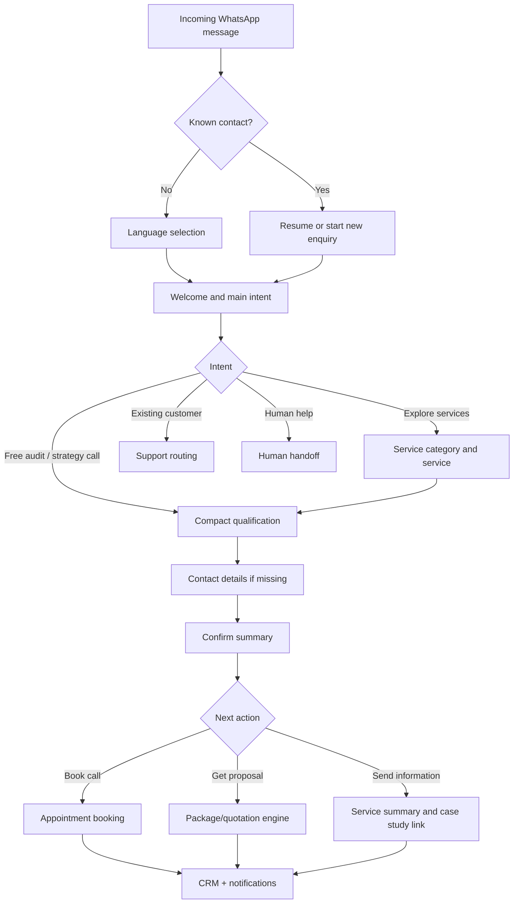

# CLICKNX WhatsApp Automation & CRM Flow

## 1. Objective

Build a bilingual WhatsApp journey that:

- responds instantly in Arabic or English;
- identifies the customer, service need, goal, readiness, and budget with minimal questions;
- records the full conversation and structured answers in the CRM;
- recommends the next best step: free audit, strategy call, package/quotation, or human support;
- tracks every lead from first message to won/lost and ongoing customer status.

This flow is based on the CLICKNX proposal and the current website offering: Google Ads, Meta Ads, CRO, analytics and tracking, social media marketing, TikTok Ads, LinkedIn Ads, programmatic advertising, and landing-page design.

## 2. Design Rules

1. Use WhatsApp buttons/lists wherever possible; do not make users type information that can be selected.
2. Ask no more than five qualification questions before showing a summary and next action.
3. Ask one question per message.
4. Save every answer immediately; customers must be able to resume later.
5. Do not force package selection before understanding the requirement.
6. Show website prices as indicative ranges only. Final pricing must be confirmed by the quotation engine or a strategist.
7. Allow `Main menu / القائمة الرئيسية`, `Back / رجوع`, `Change language / تغيير اللغة`, and `Talk to a person / التحدث مع موظف` at every major step.
8. Keep the selected language for all future sessions unless the customer changes it.

## 3. Main Customer Flow

## 4. Exact Bilingual Conversation

Variables appear in braces, for example `{first_name}`.

### Step 0 - Trigger and Contact Match

Trigger on any inbound message, click-to-WhatsApp campaign, QR code, or website WhatsApp link.

- Create or match the CRM contact using the WhatsApp phone number.
- Store source and campaign parameters where available.
- If an unfinished enquiry exists, offer `Continue / متابعة` or `Start new / طلب جديد`.
- If an existing customer asks for help, route to the customer-support branch rather than qualifying them as a new lead.

### Step 1 - Language

**Message**

> Welcome to CLICKNX 👋 Choose your preferred language.  
> مرحباً بكم في CLICKNX 👋 اختر لغتك المفضلة.

**Buttons**

- English
- العربية

CRM update: `preferred_language = en` or `ar`; stage = `New`.

### Step 2 - Welcome and Intent

**English**

> Hi {first_name_or_there}! We help UAE businesses turn advertising spend into measurable leads and revenue. What would you like to do?

**Arabic**

> مرحباً {first_name_or_blank}! نساعد الشركات في الإمارات على تحويل الإنفاق الإعلاني إلى عملاء محتملين وإيرادات قابلة للقياس. كيف يمكننا مساعدتك؟

**List options**

1. Explore services / استكشاف الخدمات
2. Get a free audit / طلب تدقيق مجاني
3. Book a strategy call / حجز مكالمة استراتيجية
4. Existing customer support / دعم العملاء الحاليين
5. Talk to a person / التحدث مع موظف

### Step 3A - Service Selection

To avoid an oversized first menu, group the nine services.

**English**: `Which area do you need help with?`  
**Arabic**: `في أي مجال تحتاج إلى المساعدة؟`

**Categories and nested services**

- Paid advertising / الإعلانات المدفوعة
  - Google Ads / إعلانات Google
  - Meta Ads (Facebook & Instagram) / إعلانات Meta (فيسبوك وإنستغرام)
  - TikTok Ads / إعلانات TikTok
  - LinkedIn Ads / إعلانات LinkedIn
  - Programmatic Advertising / الإعلانات المبرمجة
- Conversion and websites / التحويل والمواقع
  - Landing Page Design / تصميم صفحات الهبوط
  - Conversion Rate Optimization / تحسين معدل التحويل
- Data and tracking / البيانات والتتبع
  - Analytics & Tracking Setup / إعداد التحليلات والتتبع
- Organic social / التواصل الاجتماعي العضوي
  - Social Media Marketing / التسويق عبر وسائل التواصل الاجتماعي
- Multiple services / خدمات متعددة
- Not sure - recommend for me / غير متأكد - اقترح لي

For `Not sure`, ask the goal first and recommend one or more services using the routing table in Section 6.

### Step 3B - Existing Customer Support

**English**: `What do you need help with?`  
**Arabic**: `كيف يمكننا مساعدتك؟`

- Campaign/account question / استفسار عن حملة أو حساب
- Reporting/tracking issue / مشكلة في التقارير أو التتبع
- Billing/quotation / الفواتير أو عرض السعر
- Request a meeting / طلب اجتماع
- Other / أخرى

Create a support ticket, attach the conversation, assign the account owner, show a ticket code, and confirm the expected response time. Do not run sales qualification unless the customer selects a new service.

## 5. Compact Qualification Flow

Ask only the questions not already known in the CRM.

### Q1 - Primary Goal

**English**: `What is your main goal right now?`  
**Arabic**: `ما هو هدفك الرئيسي حالياً؟`

- Generate more leads / زيادة العملاء المحتملين
- Increase online sales / زيادة المبيعات عبر الإنترنت
- Improve return on ad spend / تحسين العائد على الإنفاق الإعلاني
- Fix tracking and reporting / إصلاح التتبع والتقارير
- Improve website conversions / تحسين تحويلات الموقع
- Grow brand awareness/social presence / تعزيز الوعي بالعلامة والحضور الاجتماعي
- Other / هدف آخر

If `Other`, accept one short free-text or voice-note answer and store its transcript.

### Q2 - Current Situation

**English**: `Are you currently running digital advertising?`  
**Arabic**: `هل تقوم حالياً بتشغيل إعلانات رقمية؟`

- Yes, actively / نعم، حالياً
- Previously, but stopped / سبق أن شغّلتها وتوقفت
- No, starting fresh / لا، سأبدأ من الصفر

If active, show a multi-select list: Google, Meta, TikTok, LinkedIn, other. Do not ask this follow-up for landing-page-only, CRO-only, or organic-social enquiries unless relevant.

### Q3 - Monthly Budget

**English**: `What monthly budget are you considering, including ad spend where applicable?`  
**Arabic**: `ما الميزانية الشهرية التي تفكر بها، بما في ذلك الإنفاق الإعلاني إن وجد؟`

- Under AED 5,000 / أقل من 5,000 درهم
- AED 5,000-10,000 / من 5,000 إلى 10,000 درهم
- AED 10,000-25,000 / من 10,000 إلى 25,000 درهم
- AED 25,000-50,000 / من 25,000 إلى 50,000 درهم
- AED 50,000+ / أكثر من 50,000 درهم
- Not sure yet / غير محدد بعد

The first four public website contact-form bands start at AED 5,000. The extra `Under AED 5,000` and `Not sure` options prevent abandonment and support nurture routing.

### Q4 - Timing

**English**: `When would you like to start?`  
**Arabic**: `متى ترغب في البدء؟`

- Immediately / فوراً
- Within 30 days / خلال 30 يوماً
- In 1-3 months / خلال شهر إلى 3 أشهر
- Just exploring / أستكشف الخيارات فقط

### Q5 - Business and Location

**English**: `Please send your company name and website (or Instagram page).`  
**Arabic**: `يرجى إرسال اسم الشركة ورابط الموقع (أو حساب إنستغرام).`

Accept one message. Then ask location only if it is unknown:

`Abu Dhabi, Dubai, Sharjah, Ajman, Al Ain, Ras Al Khaimah, Fujairah, Umm Al Quwain, elsewhere in the UAE, outside UAE` with Arabic equivalents.

### Q6 - Contact Details (Only If Missing)

Ask for full name and work email in a single WhatsApp Flow screen or secure mini-form. The WhatsApp number is captured automatically and should never be asked again.

### Summary and Consent

**English**

> Thanks, {name}. Here is what we understood:  
> Service: {service}  
> Goal: {goal}  
> Budget: {budget}  
> Start: {timeline}  
> Company: {company}  
> Is this correct?

**Arabic**

> شكراً {name}. هذا ملخص طلبك:  
> الخدمة: {service_ar}  
> الهدف: {goal_ar}  
> الميزانية: {budget_ar}  
> موعد البدء: {timeline_ar}  
> الشركة: {company}  
> هل المعلومات صحيحة؟

**Buttons**: `Confirm / تأكيد`, `Edit / تعديل`, `Human help / مساعدة موظف`.

After confirmation, obtain concise permission to store the details and contact the lead. Store timestamp, copy version, and response.

## 6. Recommendation and Routing Logic

| Customer signal | Recommend/route |
|---|---|
| High-intent search demand, calls, enquiries | Google Ads |
| Consumer discovery, visual product/service, retargeting | Meta Ads |
| Short-form creative and younger audiences | TikTok Ads |
| B2B decision-makers, job-title/company targeting | LinkedIn Ads |
| Broad, automated media reach across sites/apps | Programmatic Advertising |
| Traffic exists but conversion is weak | CRO |
| Campaign needs a focused conversion destination | Landing Page Design |
| Data is missing/unreliable or attribution is unclear | Analytics & Tracking Setup |
| Ongoing organic content/community need | Social Media Marketing |
| Multiple gaps or the user is unsure | Free audit, then bundled recommendation |

### Lead Priority

- **Hot**: start immediately/within 30 days AND budget AED 10,000+; notify strategist immediately.
- **Warm**: 1-3 months, AED 5,000+, or strong need with undecided budget; offer strategy call and follow-up sequence.
- **Nurture**: just exploring or under AED 5,000; send a relevant resource/free audit option and request follow-up permission.
- **Existing customer**: assign to account owner; no sales score unless it is an expansion enquiry.

CRM stores the score and the individual reasons. A human can override it.

## 7. Results Screen and Next Actions

After confirmation, show no more than three actions:

1. `Book free 30-min call / حجز مكالمة مجانية لمدة 30 دقيقة`
2. `Request proposal / طلب عرض`
3. `Send service details / إرسال تفاصيل الخدمة`

For high-fit leads, preselect the call as the recommended action. For fixed-scope services such as tracking setup or a landing page, proposal generation may be offered immediately. Paid-media retainers should normally receive an indicative range followed by an audit/strategy call.

### Appointment Booking

1. Fetch available calendar slots in Asia/Dubai timezone.
2. Show the next three suitable slots plus `More times / مواعيد أخرى`.
3. Confirm date, Dubai time, attendee email, and meeting mode.
4. Create calendar event and CRM activity.
5. Send confirmation plus 24-hour and 1-hour reminders.
6. Allow `Reschedule / تغيير الموعد` and `Cancel / إلغاء`.

### Package and Quotation Generator

Use an admin-managed service/package catalogue. Each package record contains service, Arabic/English name and description, deliverables, billing frequency, fee range/fixed fee, tax rule, validity period, and terms version.

Website-listed indicative ranges currently include:

| Service | Indicative website range |
|---|---|
| Google Ads Management | AED 1,000-15,000/month, tiered by ad spend |
| Meta Ads | AED 2,500-18,000/month, tiered by ad spend |
| TikTok Ads | AED 3,000-20,000/month, tiered by ad spend |
| LinkedIn Ads | AED 3,500-25,000/month, tiered by ad spend |
| Social Media Marketing | AED 3,000-16,000/month |
| CRO | AED 5,000-30,000 |
| Analytics & Tracking | AED 3,000-20,000 |
| Landing Page Design | AED 3,000-20,000 |
| Programmatic Advertising | AED 4,000-30,000/month, tiered by ad spend |

Do not hard-code these values into conversation nodes. Load them from the catalogue so website and WhatsApp pricing stay synchronized.

On `Request proposal`:

1. Validate required CRM fields.
2. Select a catalogue package or send to strategist for a custom scope.
3. Generate unique code `CX-Q-{YYYYMM}-{5-digit sequence}`, e.g. `CX-Q-202609-00127`.
4. Generate bilingual or selected-language PDF with customer, scope, deliverables, fees, VAT, validity, terms, and acceptance link.
5. Save the PDF URL and version in CRM; send it through WhatsApp.
6. Update stage to `Quotation Sent` and schedule follow-ups.
7. On acceptance/payment, update to `Won/Customer`, create onboarding tasks, and notify finance and delivery.

Never generate a binding quotation from free text alone. A valid catalogue price or strategist approval is required.

## 8. CRM Data Model

### Contact

- Contact ID, WhatsApp number, full name, work email
- Preferred language, location, timezone
- Consent status, timestamp, and copy version
- First-touch source, campaign/UTM, referrer
- Existing-customer flag and account owner

### Company

- Company name, website/social URL, industry
- Emirate/country, business type (B2B/B2C/e-commerce)
- Current marketing platforms

### Enquiry/Opportunity

- Opportunity ID and created date
- Selected category/service(s)
- Main goal and free-text requirement/transcript
- Current advertising status/platforms
- Monthly budget band and start timeline
- Lead temperature, score, score reasons
- Recommended service/package
- Stage, owner, next action, next-action date
- Lost reason or disqualification reason

### Activity and Commerce

- Full message log with direction, timestamp, language, delivery/read status
- Appointment ID/status/time
- Quotation code, version, amount, validity, status, PDF URL
- Order/payment status, invoice ID, onboarding status
- Support ticket ID and SLA status

## 9. CRM Pipeline

`New → Engaged → Qualified → Appointment Booked → Audit/Discovery → Proposal Requested → Quotation Sent → Negotiation → Won/Customer`

Alternative terminal stages: `Nurture`, `Unqualified`, `Lost`, `Spam`, and `Opted Out`.

Stage movement must be event-driven:

- first bot response: `New`;
- language/intent response: `Engaged`;
- summary confirmed with essential fields: `Qualified`;
- calendar success: `Appointment Booked`;
- quote PDF delivered: `Quotation Sent`;
- accepted/paid: `Won/Customer`;
- explicit decline: `Lost` with reason;
- no immediate fit but permission to follow up: `Nurture`.

## 10. Human Handoff and Notifications

Handoff immediately when:

- the user requests a person twice or types an agent keyword;
- sentiment is negative, there is a complaint, or the bot fails twice;
- the request is custom/unclear or needs a non-catalogue quotation;
- a hot lead confirms the summary;
- an existing customer reports an urgent campaign/tracking issue.

The agent receives a concise card: language, contact/company, selected service, goal, budget, timeline, lead score, conversation summary, and recommended next action. The bot tells the customer whether the team is online (Monday-Friday, 9:00 AM-6:00 PM UAE time) and sets the correct expectation outside business hours.

## 11. Follow-Up Automations

- Abandoned before qualification: one reminder after 2 hours; one final reminder after 24 hours.
- Qualified but no booking: reminder after 24 hours; useful case study/resource after 3 days; final check-in after 7 days.
- Appointment: confirmation immediately; reminders at 24 hours and 1 hour.
- Quotation: confirm delivery immediately; follow up after 2 business days and 5 business days; notify owner before expiry.
- Nurture: only with consent; service-relevant message after 14-30 days.
- Stop all sales automation on opt-out, human takeover, lost status, or reply. Respect WhatsApp template and 24-hour-session requirements.

## 12. Validation, Error, and Compliance Rules

- Validate email, URL, calendar slot, and catalogue availability.
- If a button/list expires, offer the current menu instead of restarting.
- After two unrecognized answers: offer examples and a human handoff.
- Arabic must be native RTL copy, not transliterated Arabic; retain brand/platform names where clearer.
- Treat voice notes as valid input; transcribe, show a summary, and ask for confirmation.
- Mask sensitive information in logs and use role-based CRM access.
- Record consent and opt-out; `STOP`, `UNSUBSCRIBE`, `إلغاء`, or `توقف` must immediately suppress marketing messages.
- Do not request ad-account passwords or payment-card details in WhatsApp.

## 13. Admin Requirements

The admin application should provide:

- a unified WhatsApp-like inbox with bot/human takeover and assignment;
- contacts, companies, opportunities, support tickets, bookings, and quotations;
- editable bilingual service/package catalogue and price ranges;
- flow versioning, template management, business hours, and routing rules;
- searchable conversation history and structured response view;
- funnel dashboard by source, language, service, stage, budget, owner, and outcome;
- SLA, abandonment, appointment, quote, win/loss, and revenue reporting;
- audit log for pricing, stage, owner, quote, consent, and manual overrides.

## 14. Suggested KPIs

- first-response time;
- language-to-intent completion;
- qualification completion and abandonment by question;
- qualified leads by service/source/budget;
- appointment booking and show rate;
- quotation request, delivery, acceptance, and expiry rate;
- lead-to-customer conversion and revenue;
- human-handoff rate and bot fallback rate;
- Arabic versus English conversion performance;
- opt-out and template failure rate.

## 15. Implementation Acceptance Criteria

1. A new contact can complete either language journey without a human.
2. All visible copy and service/package content are available in English and Arabic.
3. A returning contact resumes without repeating saved questions.
4. Every answer, message, stage change, appointment, quotation, and order is linked to the same CRM contact/opportunity.
5. A hot lead notification reaches the assigned strategist with a complete summary.
6. Appointment slots cannot be double-booked and display in UAE time.
7. A quotation cannot be issued without a valid catalogue version or approval.
8. Opt-out immediately stops all non-transactional messages.
9. The admin can update services, price ranges, copy, routing, and templates without code changes.
10. End-to-end tests cover English, Arabic, returning lead, existing customer, abandoned flow, human handoff, booking, quotation, acceptance, and opt-out.
